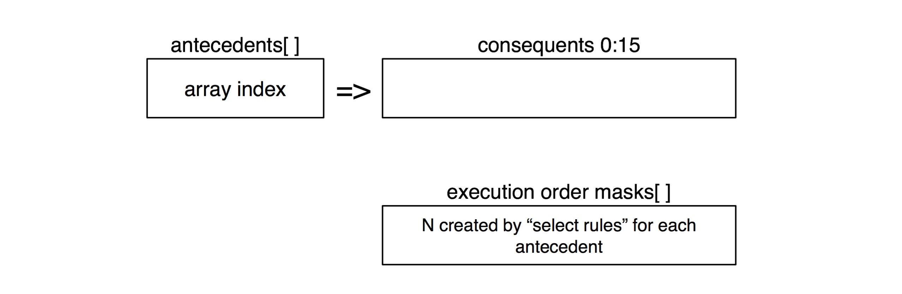

# x-inference
Inference engine experimentation

The central idea here is to process inference rules symbolically. Given the form of a rule ```if A then B```,
we do not immediately
care what A and B represents, only that each A in a list of rules have some number of then conditions. Also, given a number
of rules with A on the LHS, like:
```
A=>B
A=>C
A=>F
```
we can rewrite these rules as ```if A then B|C|F```. Maybe that's useful in the long run, as FPGAs do bitwise
logical operations for free.

I'm assuming the symbols do relate to real things, but we only care about these on the input and output from the engine
itself. This implies we could have a symbol map (database?) that is only consulted when a human wants to know results. 
I think the bulk of the processing time is rules processing, so symbol to readable name mapping hopefully is
low performance impact relative to rules processing. We'll see.

Let's start with forward chaining (why not?), straight symbol manipulation, cycling through three
sequential steps: match rules, select rules, and execute rules.

1. **Match Rules** Find all rules triggered by current knowledgebase contents.  
2. **Select Rules** Prioritize matched rules to determine execution order.  
3. **Execute Rules** Execute each matched rule, obtain new facts for knowledgebase.
4. **Exit** When step 1 no longer has any matches.

Now, I'm not certain exactly what all of that means or how to implement it, and in the best Agile manner,
I'm going to figure it out as I go along. 

Let's start with an antecedents (LHS) array, where each antecedent id identified by its array index. The contents
of each array element is a set of 16 consequents for that antecedent. I think execution order is dynamic and
created each step 2, so let's make the execution order an array of masks for the consequents.



If I have a rule ```if A then B|C|F``` and I did not care about execution order, then I would store this as
```
antcedents[0] = 0x6400;
```
If I cared about order, let's say
```
A=>B
A=>C
A=>F
```
then I would have three execution order masks:
```
masks[0] = 0x4000;
masks[1] = 0x2000;
masks[2] = 0x0400;
```
Each antecedent would need some number of masks, so maybe use a linked list of mask arrays?
